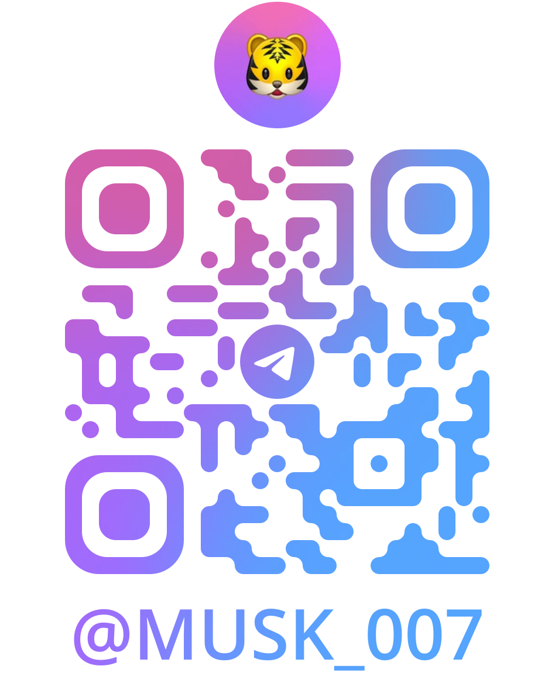

# 🇪🇸 Spain Cita Previa (4010 Fingerprint / TIE Card) Slot Monitor

[中文](README.md) | [English](README.en.md) | [Español](README.es.md)

> A **non-profit, public-interest** monitoring project for Spain residency appointment availability. Provides transparent and real-time appointment status and historical heatmap to help applicants track availability patterns.

🌐 **Live Dashboard**: [https://aijiesd520.github.io/cita_status.github.io/](https://aijiesd520.github.io/cita_status.github.io/)

---

## 📌 About The Project

Securing an appointment for residency card issuance / fingerprinting in Spain (`4010 - POLICIA-TOMA DE HUELLA (EXPEDICIÓN DE TARJETA)`) is often difficult due to unpredictable slot releases and lack of transparency.

This project passively checks appointment availability around the clock and visualizes the results in a 7-day slot availability heatmap.

### ✨ Features
- **Real-Time Status**: Instant overview of slot availability across Madrid, Barcelona, Valencia, and other provinces.
- **7-Day Historical Heatmap**: 48 slots per day (30-minute intervals from 00:00 to 24:00 Madrid time) reflecting historical release trends.
- **Lightweight & Privacy-First**: Pure static site with zero external trackers, fully responsive on mobile and desktop.

---

## 📊 Legend

- 🟩 **Green Gradient (Less ↔ More)**: Available appointment slots detected; dynamically rendered as a continuous gradient based on relative slot availability density (light green = fewer hits, dark green = sustained availability).
- 🟥 **Red**: Probe error or network anomaly (frequent probe errors in time slot).
- ⬛ **Dark Gray**: Probe successful, no slots available.
- ⬜ **Light Gray**: No data or future time slots.

*Note: All times are displayed in **Spain (Madrid) local time**.*

---

## ⭐ Support & Contact

- **Give a Star**: If you find this project helpful, please consider giving it a **Star ⭐** on GitHub to help more people discover it!
- **Request More Cities / Procedures**: If you need monitoring for **additional provinces** (e.g. Alicante, Sevilla, Málaga, Zaragoza, etc.) or **other procedures** (e.g. 4036 card pickup, 4058 passport procedures, etc.), feel free to reach out.
- **Telegram Community / Contact**:

  
  
<i>Scan the QR code above to connect on Telegram</i>

---

## ⚠️ Disclaimer

1. This project is **strictly non-profit and informational**, providing only status checks and historical statistics.
2. We **DO NOT provide booking services, slot purchasing, or automated reservation**.
3. We **DO NOT collect any personal identifiable information**.
4. Official booking must be done via the Spanish Government portal: [Sede Electrónica - Cita Previa](https://icp.administracionelectronica.gob.es/icpplustiem/citar).

